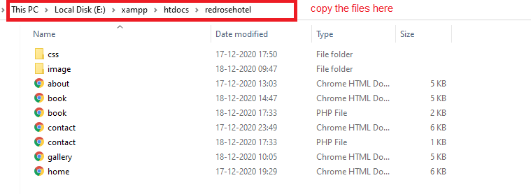
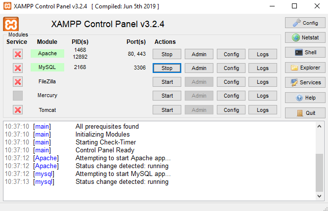
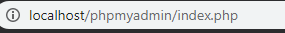
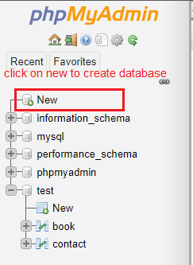
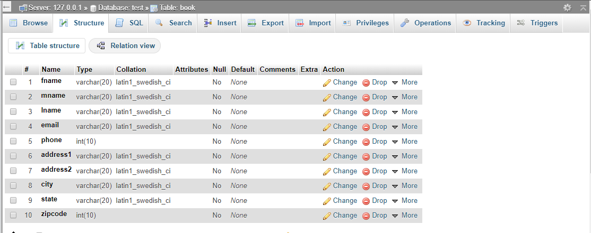
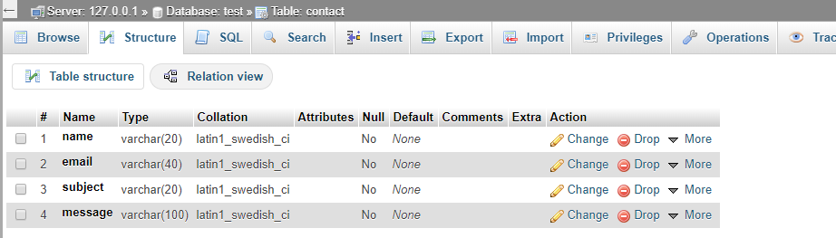

Requirement to run this website 

1.Install xampp on your machine to download that click on this link : https://www.apachefriends.org/download.html   

2.Install any code editor to modify things as per your need i used vs code : https://code.visualstudio.com/

3.2 RAM GB minimun requirement

To deploy this website on your local xampp server please follow the given steps

1.After Installation copy this folder into ".xampp/htdocs' folder.    

2.Open control panel of xampp server and start apache server.

3.Open browser and go to localhost/[yourfoldername] mine was redrosehotel

4.Congratulations your website is on your local server now

To Create database for the contact us and booking page

1.Go to localhost/phpmyadmin

2.On the left hand-side you can see all the databases click on new give your data base a name. *mine was test so you have to modify your code accordingly 

3.Now click on the newly created database and click on New  to create table for your database.

4.Take refrence from here for the tables.

Table For booking

Table For contact us

